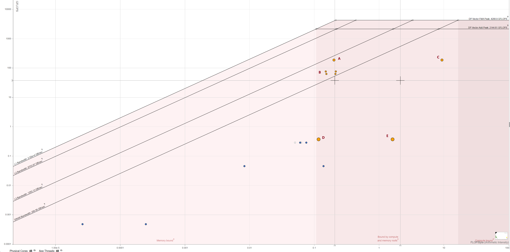

By giving parameter `-n 1000` with thread number $24$, the generated roofline plot is save to `plots/roofline_omp.html`. 

The size of points reflects the weight of self elapsed time. The orange color indicates it is vectorized and the blue color denotes scalar.

The vectorized data points are located within the area that ``Bound by compute and memory roofs''. Point $A$ is related to the inner loop of `eval_pef`, which is bounded by L3 Bandwidth and close to the "DP Vector FMA Peak" roofs, indicating that these vectorized portions of the code are achieving near-peak computational performance. The four point near $B$ are loops in function `loopcode` which are also bounded by L3 Bandwidth. Point $D$ and Point $E$ are the loops in function `eval_pef` which handle the remain nodes after manual vectorization using AVX256. The size of point is big since they have larger self elapsed time than other vectorized points, as they are auto vectorized by `simd` directive.

Most scalar data points are located within the area that ``Bound by memory roof''. They are loops in function `initMatrix` which is not not parallelized. Their performance is limited more by memory access speeds than by computational capability.

Overall, `omp` implmentation exhibits both compute-bound and memory-bound characteristics. Scalar parts of the code (blue points) that are below the peak performance could benefit from vectorization or parallelization to move them closer to the computational roofs.
